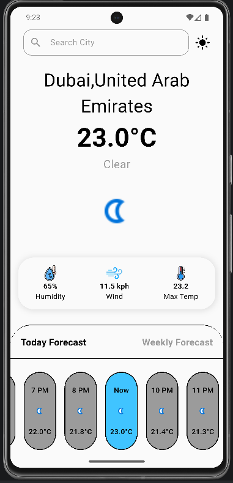
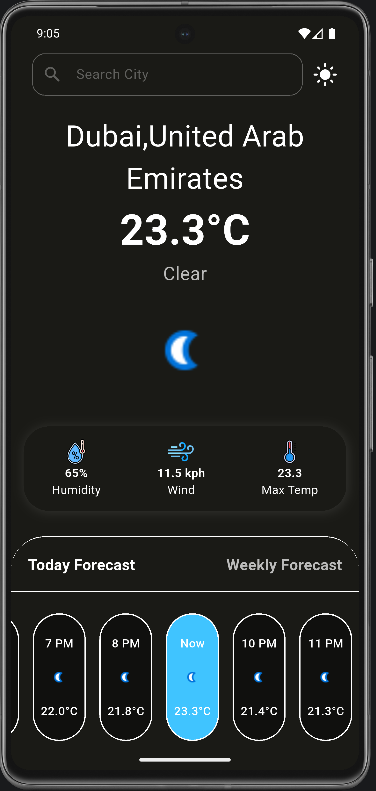
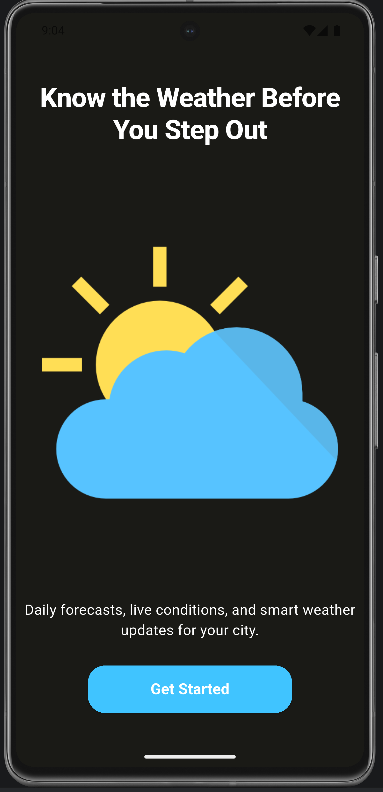
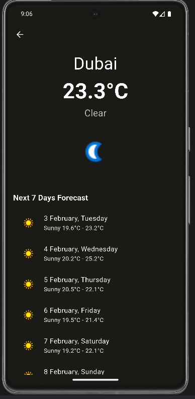

<<<<<<< HEAD
### 🌤️ Weather App (Flutter)

A modern Weather Application built using Flutter that provides real-time weather information and a
7-day forecast based on the selected city.
The app supports both Light and Dark themes for a better user experience and uses the WeatherAPI to
fetch accurate weather data.

### Features

 * Search weather by city name

 * View current weather conditions

 * 7-day weather forecast

 * Light & Dark theme support

 * Real-time weather data using WeatherAPI

 * Clean and responsive UI

### Technologies Used

- Flutter (Dart)

- WeatherAPI – for weather data

- Material UI

- HTTP package

### API Used

This project uses the free Weather API provided by:

🔗 https://www.weatherapi.com/

Data fetched includes:

Current temperature

Weather condition & icons

Humidity, wind speed

7-day forecast

=======
>>>>>>> 7374fb9 (Update README locally)
